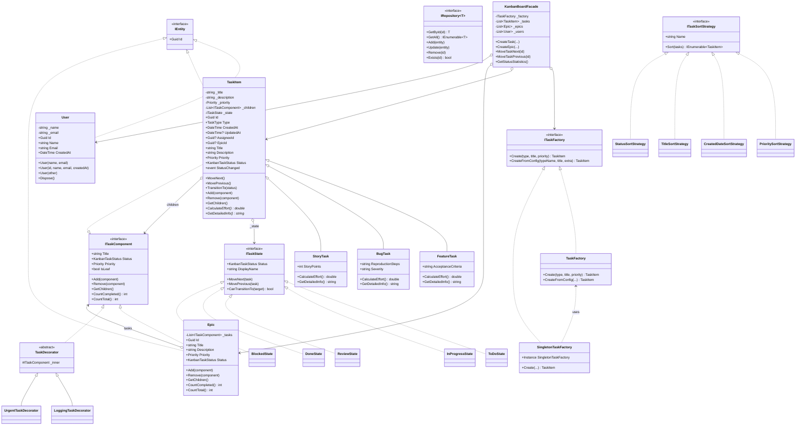

# Kanban Tracker — Навчальна практика з ООП (C# + Avalonia UI)

Мініпроєкт для проходження навчальної практики з об'єктно-орієнтованого програмування.

## Предметна область

**Трекер завдань (Канбан-дошка)**

| Сутності | Патерни (обов'язкові за темою) |
|----------|--------------------------------|
| Task, Epic, User | **State** (статуси), **Composite** (підзадачі), **Factory** (типи задач) |

Додатково реалізовано: Strategy, Observer, Decorator, Facade, Singleton.

---

## UML-діаграма класів (Domain)



### Спрощена схема (текстом)

```
ITaskComponent
 ├── TaskItem
 │    ├── FeatureTask
 │    ├── BugTask
 │    └── StoryTask
 └── Epic

ITaskState  ←── TaskItem._state
 ├── ToDoState
 ├── InProgressState
 ├── ReviewState
 ├── DoneState
 └── BlockedState

ITaskFactory
 ├── TaskFactory
 └── SingletonTaskFactory

KanbanBoardFacade  →  Factory, Tasks, Epics, Users
```

---

## Структура рішення

```
KanbanTracker/
├── KanbanTracker.Domain/          # Сутності, інтерфейси, патерни, винятки
│   ├── Entities/                  # User, TaskItem, FeatureTask, BugTask, StoryTask, Epic
│   ├── Enums/                     # KanbanTaskStatus, TaskType, Priority
│   ├── Exceptions/                # Domain / Validation / InvalidStatusTransition / TaskNotFound
│   ├── Interfaces/                # IEntity, ITaskComponent, ITaskState, IRepository
│   └── Patterns/
│       ├── State/
│       ├── Factory/
│       ├── Strategy/
│       ├── Observer/
│       ├── Decorator/
│       ├── Facade/
│       └── Composite (через ITaskComponent)
├── KanbanTracker.Application/     # Сервіси, DTO, Repository, JSON
├── KanbanTracker.UI/              # Avalonia MVVM (Канбан-дошка)
└── KanbanTracker.Tests/           # xUnit + Moq
```

---

## Застосовані принципи та патерни ООП

### Розділ I — Основи ООП
- Інкапсуляція + валідація в сетерах
- Конструктори: основний, з параметрами, копіювальний
- `IDisposable` / фіналізатор
- Наслідування + `virtual` / `override`
- Інтерфейси та контракти
- Індексатори, перевантаження операторів (`+`, `==`, `!=`)

### Розділ II — Дані та помилки
- Generics: `IRepository<T>`, `InMemoryRepository<T>`
- Колекції: `List<T>`, `Dictionary<TKey,TValue>`
- LINQ: `Where`, `GroupBy`, `OrderBy`, `Average`, `Sum`
- Ієрархія Custom Exceptions
- Retry Policy з експоненційною затримкою

### Розділ III — SOLID + патерни
| Патерн | Призначення в проєкті |
|--------|------------------------|
| **State** | Переходи статусів задачі (ToDo → InProgress → Review → Done / Blocked) |
| **Composite** | Дерево підзадач + Epic як контейнер |
| **Factory Method** | Створення Feature / Bug / Story / Technical |
| **Singleton** | `SingletonTaskFactory.Instance` |
| **Strategy** | Сортування задач (Priority, Date, Title, Status) |
| **Observer** | Подія `StatusChanged`, `TaskEventPublisher` |
| **Decorator** | Logging / Urgent обгортки |
| **Facade** | `KanbanBoardFacade` — єдиний вхід до домену |

SOLID: SRP (шари), OCP (розширення через патерни), LSP (підтипи TaskItem), ISP (вузькі інтерфейси), DIP (залежність від абстракцій).

### Розділ IV — Серіалізація та тести
- JSON (`board.json` у папці проєкту)
- DTO: `TaskDto`, `EpicDto`, `UserDto` + мапінг Domain ↔ DTO
- Unit-тести (xUnit) + Moq

---

## Як запустити

### Вимоги
- .NET 8 SDK
- Windows / Linux / macOS (Avalonia)

### Команди
```bash
cd KanbanTracker
dotnet restore
dotnet build
dotnet run --project KanbanTracker.UI
dotnet test
```

### Збереження даних
- Файл: `board.json` у корені рішення (поточна робоча директорія)
- **Save** — запис стану
- При наступному запуску дані підвантажуються автоматично
- Якщо файлу немає — завантажуються демо-дані

---

## Використання UI

| Дія | Як |
|-----|-----|
| Створити задачу | Title + Description + Type + Priority → **+ Add Task** |
| Перемістити | Кнопки **Next →** / **← Prev** (State) |
| Видалити | **Del** |
| Пошук | Текст → **Search** (по назві, опису, типу) |
| Сортування | Вибір стратегії → **Sort** |
| Зберегти | **Save** → `board.json` |

На картці відображаються: назва, тип, пріоритет, опис, **дата створення**.


---

